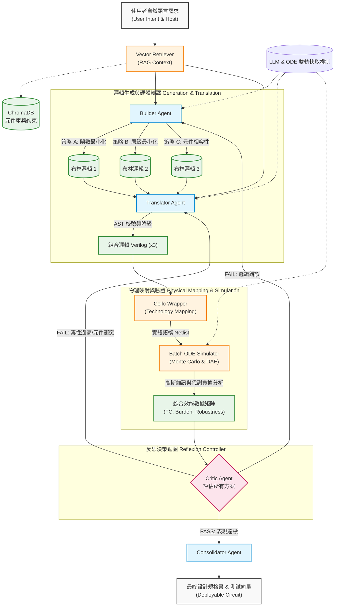

# LLM-Cello-BioDrive: Automated Genetic Circuit Design & Verification Framework

## 專案簡介 (Introduction)
這個專案的建立旨在搭建一個「自動化基因電路設計代理 (Agentic Genetic Circuit Designer)」。系統能夠接收使用者的自然語言需求，將其自動轉換為經過生化動力學驗證的實體基因電路。本架構導入了「邏輯多樣性生成」與「實體最佳化」分離的核心精神，不再依賴單一模型完成生成，而是構建了一個強大且穩健的多智能體批次評估 (Multi-Agent Batch Evaluation) 流水線。
## 核心功能 (Key Features)

#### 1.狀態驅動的智能體架構 (State-Driven Agentic Workflow)
拋棄單純的對話歷史拼接，系統內部採用嚴謹的 CircuitState 狀態機結構，精確追蹤每一輪的拓樸草案、審查意見、模擬結果與錯誤日誌，確保多智能體協作過程中的上下文穩定性。
#### 2.人機協作與動態約束 (Human-in-the-Loop & Dynamic Constraints)
系統不會盲目黑箱作業。在智能體完成初步對抗設計後，工作流會暫停並進入人機協核階段。研究人員可以檢視完整的辯論邏輯，並能隨時注入額外的生物學限制（例如：指定生物安全等級、避免高拷貝載體），系統將帶著完整的歷史記憶重啟迭代。
#### 3.真實元件檢索增強 (RAG-based Component Grounding)
支援解析 Cello UCF (User Constraint File) 規格，將真實實驗室表徵過的感測器與邏輯閘寫入 ChromaDB 向量資料庫，確保 AI 設計具備物理真實性。
#### 4.自動化生化參數探勘 (Biokinetic Data Mining)
內建 Data Miner Agent，可非同步針對 BioNumbers 等學術資料庫進行爬蟲，萃取解離常數 ($K_d$)、轉錄/轉譯率與降解率，並自動標準化為系統單位（nM 與秒）。
#### 5.剛性方程與蒙地卡羅模擬 (Stiff ODE & Monte Carlo Analysis)
Stiff ODE Solver：採用 scipy.integrate.solve_ivp 的 Radau 演算法，精確處理生物系統中時序差異極大的剛性動力學方程。

參數擾動與群體模擬：對基礎參數疊加高斯噪音 (Gaussian perturbation)，模擬細胞群體間的外在雜訊 (Extrinsic Noise)，繪製動態時序軌跡與分佈通道。
#### 6.自動化效能評估 (Automated Oracle Verification)
透過自動萃取真值表 (Truth Table) 計算 ON/OFF Fold Change。
設立總蛋白質代謝負荷閾值，動態攔截因資源耗盡引發的非預期細胞毒性崩潰。
#### 7.全端本地化與隱私防護 (Local LLM & Embedding Support)
全面支援 Ollama 等本地端模型運行。從 RAG 的向量嵌入（Embeddings）到多智能體的邏輯推理，皆可在無網際網路連線的情況下於本地伺服器執行，確保敏感基因序列與專利設計的絕對隱私。
## 核心系統工作流 (System Workflow)
當使用者在前端輸入自然語言需求後，系統將在背後經歷以下五個完整的生命週期階段：
#### 1.意圖解析與知識檢索 (Intent & Retrieval): 
系統讀取使用者需求與選定的宿主生物，並透過 Embedding 模型至 ChromaDB 檢索相關的生物元件庫與生化約束，形成 rag_context。
#### 2.邏輯生成與硬體描述轉譯 (Generation & Translation): 
Builder Agent 負責生成 3 組不同化簡策略的布林邏輯提案。接著，Translator Agent 會將這些邏輯精準轉譯為 Cello CAD 軟體支援的組合邏輯 Verilog 程式碼。
#### 3.實體映射與動態模擬 (Mapping & Simulation): 
透過 Cello Wrapper 呼叫 Cello 工具，將抽象 Verilog 對應到真實的生物元件 (Technology Mapping)。隨後由 Batch ODE Simulator 針對各組拓樸執行蒙地卡羅 (Monte Carlo) 常微分方程解算，產生動態生化曲線與效能數據。
#### 4.多智能體對抗與決策 (Reflexion & Routing):
Critic Agent 負責檢視所有候選方案的拓樸與模擬數據。若達標則選出最佳解；若不佳則執行根因分析，判定為邏輯錯誤 (LOGIC_ERROR) 或元件約束錯誤 (PART_ERROR) 並退回重試，最多自動迭代 3 輪。
#### 5.人機協作與最終驗證 (Human-in-the-loop & Validation): 
系統呈現對抗紀錄與結果給使用者。使用者可追加條件進行手動反饋，或透過 Consolidator Agent 產出最終設計規格矩陣，最後由 Oracle Evaluator 產生供實體 Cello 平台使用的 .v 網表檔案。

## 邏輯生成的多樣性策略 (Logic Diversity Strategies)
在 Builder Agent 階段，系統會並行生成三種具有不同側重點的布林邏輯提案。之所以不只生成一個「最簡化」的邏輯，是因為生物電路的實作受限於極其有限的元件庫與嚴苛的生化代謝壓力。
#### 1.閘數最小化策略 (Gate-Count Optimization):
目標： 利用布林代數化簡，將所需的邏輯閘數量降到最低。

優勢： 減少宿主細胞的代謝負擔 (Metabolic Burden)。較少的元件意味著較低的蛋白質合成壓力，能提高細胞的存活率與生長穩定性。
#### 2.層級最小化策略 (Depth/Latency Optimization):
目標： 縮短從輸入訊號到最終輸出之間的邏輯層級。

優勢： 優化時序效率 (Temporal Efficiency)。在生物系統中，訊號穿過每一層邏輯閘都會產生顯著的時間延遲。減少層級可以加快電路反應速度，避免訊號在傳遞過程中因衰減而消散。
#### 3.元件相容性導向策略 (Library-Aware/Robustness Strategy):
目標： 避開複雜的複合門（如複雜的 AOI 邏輯），優先使用宿主生物元件庫（UCF）中最穩定、特徵化最完整的常用元件（如常用的 Repressors）。

優勢： 提高技術映射 (Technology Mapping) 的成功率。有時邏輯最簡的電路，可能因為找不到對應的啟動子或阻遏蛋白而無法在物理層面實現，此策略能確保「有藥可醫」。
### 為什麼要這麼做？ (The Rationale)
#### 1.對沖生化風險： 
生物元件具有「非線性」與「漏電」特性。一個在邏輯上完美的電路，在 ODE 模擬中可能會因為連鎖反應導致背景電流過大（Leakage）。生成多樣性提案能讓後續的 Critic Agent 有機會從中挑選出抗噪能力最強的設計。
#### 2.突破 Cello 映射限制： 
Cello 在進行實體元件指派時，常會因為特定元件的干擾（Crosstalk）或重複序列（Homologous Recombination）而失敗。三種策略提供了三種不同的拓撲結構，極大地增加了通過驗證的機率。
#### 3.從代碼生成到架構探索：
這體現了 Agent 的決策價值——它不只是翻譯員，而是會根據生化常識提供不同工程取捨（Trade-offs）的資深設計師。
## 生化動力學與科學評分機制 (Evaluation & Scoring)
#### 1.功能正確性 (Functional Scorer): 
評估無雜訊理想條件下的邏輯辨識度，包含 Fold Change (FC) Score、邏輯吻合度以及針對背景漏電的 Margin Score 懲罰。
#### 2.動力學與物理限制 (Kinetic Scorer):
引入高斯分佈噪音 (15% 變異量) 進行平行的蒙地卡羅壓力測試。分析引入雜訊後的穩健度保留係數 ($R_{Kinetic}$)、代謝毒性負擔 ($P_{Burden}$)，以及跨越啟動閾值所需的時序效率 ($Score_{Temporal}$)。
#### 3.靜態合理性 (Static Plausibility):
分析網路拓樸結構，針對過深層級的電路預先折扣，並對重複的元件序列施加同源重組 (Homologous Recombination) 懲罰。
#### 4.生化資源競爭模型 (DAE Simulation): 
模擬全域資源（如 RNA 聚合酶與總核醣體）天花板，動態結算游離態資源，並利用 Michaelis-Menten 動力學修正基因表現速率，真實反映多基因並行時的相互排擠效應。
## 前端自定義開關與控制 (Configuration Toggles)
使用者可透過介面切換以下開關，動態改變底層狀態機的路由邏輯：
#### 1.啟用 RAG (預設 ON): 
結合向量庫增強生成；關閉則進入完全依賴模型內部知識的 Zero-shot 模式。
#### 2.啟用自動化 ODE 模擬 (預設 ON): 
解算剛性微分方程提供定量分數；關閉可大幅加速系統反應時間以進行純拓樸預覽，但 Critic 將失去動態數據輔助判斷。
#### 3.啟用 Multi-Agent 架構 (預設 ON):
啟動完整的反思修正迴圈；關閉則進入 Single-Pass 模式，繞過 Critic 審查進行快速直通生成。
#### 4.啟用 LLM 與 ODE 快取 (預設 ON): 
結合 LiteLLM 與 Joblib 提供雙軌持久化快取機制，大幅節省 API 成本與算力。若想強迫模型發揮新創造力或重新抽取高斯噪音進行壓力測試，可關閉快取或進行清除。

## 授權

This project is licensed under the MIT License - see the LICENSE file for details.
