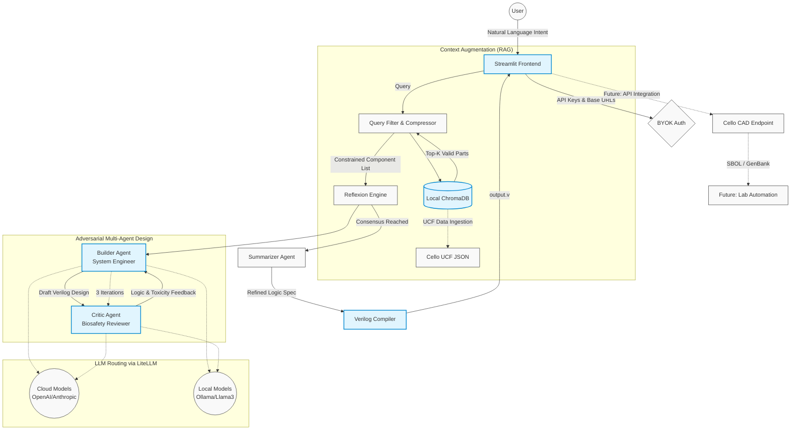

# A-Multi-Agent-Framework-for-Translating-Natural-Language-to-Genetic-Circuits
本專案旨在降低合成生物學中基因電路設計的門檻。透過引入大型語言模型（LLMs），系統能將研究人員輸入的「自然語言描述」自動轉譯為 Cello 軟體可接受的硬體描述語言（Verilog）。 目前專案處於 MVP（最小可行性產品）階段，核心實作了多智能體對抗式設計 (Adversarial Multi-Agent Design) 機制，並透過兩階段輸出流程確保生成結果兼具邏輯嚴密性與使用者可讀性。，確保生成的基因電路邏輯嚴密且符合使用者預期。
開發方法聲明 (Development Methodology)
本專案的 MVP 原型採用了 AI 輔助編程工具（Cursor Vibe Coding,Google Anigravity）進行快速迭代開發。專案的核心學術與工程價值在於「系統工作流程架構設計」與「高約束性提示詞工程 (Prompt Engineering)」，基礎程式碼與介面橋接則藉助工具加速完成，以專注於驗證概念的可行性。

## Core Features

### 三輪對抗式設計 (Adversarial Multi-Agent Design)
系統內建「建構師 (Builder)」與「審查員 (Critic)」兩個獨立的 LLM 角色。
Builder 負責根據需求草擬電路設計，並在受到批評時進行學理辯護；
Critic 則從三個維度審查設計：

- 🛑 **INTENT_INVALID**：需求本身是否違反生物學基本原理
- ⚠️ **MISALIGNMENT**：設計是否偏離使用者的原始意圖
- 🛑 **FATAL**：設計中是否出現未預期的邏輯短路或資源競爭

雙方進行 3 輪閉環討論，透過 Reflexion 機制迭代修正設計。

### 兩階段輸出流程 (Two-Stage Output Pipeline)
辯論結束後，系統採用兩個獨立角色處理輸出，職責嚴格分離：

- **Design Consolidator**：整合 Builder 最終版本與 Critic 最終意見，
  產出人類可讀的五區塊設計規格書，供使用者在 HITL 步驟審閱與編輯。
- **Verilog Compiler**：接收使用者確認後的規格書，純粹執行格式轉換，
  不做任何設計判斷，精準產出符合 Cello 規範的 `.v` 檔案。

### 人類在迴路中 (Human-in-the-Loop, HITL)
系統設有兩個使用者介入點：

1. **辯論結束後**：使用者可選擇確認總結，或追加條件重啟 3 輪辯論。
2. **規格書產出後**：使用者可直接編輯規格書文字，或追加條件重啟辯論；
   確認無誤後才進入 Verilog 編譯階段。

### 高約束檢索增強生成 (High-Constraint RAG)
導入本地向量資料庫 (ChromaDB)，在辯論前先將使用者需求向量化並檢索最相關的
Cello 元件，強制 LLM 僅能在真實存在的 Sensor 與 Gate 清單中進行設計。
若 RAG 無法提供完整資料，系統將進入優雅降級模式，允許 Builder 動用內部知識，
並在規格書中明確標註需人工核實的元件。

### 資安與成本控管 (BYOK 模式)
採用 Bring Your Own Key 模式，使用者需輸入自己的 API Key 執行運算。
透過 `litellm` 實作 LLM 路由層，支援雲端模型（OpenAI / Anthropic）與
本地端推論伺服器（Ollama / Llama 3），研究人員可在完全斷網的封閉環境中
執行設計，確保實驗資料零外洩。

Technical Highlight

本專案的核心架構融合了大型語言模型 (LLM) 編排技術與合成生物學領域知識，重點突破了傳統 AI 在基因電路設計上容易產生的「幻覺」與「資安風險」問題。

1. 對抗式多智能體系統 (Adversarial Multi-Agent System)
有別於單一 Prompt 生成程式碼容易出現邏輯盲區的問題，本系統建構了三輪閉環的對抗式對話機制。
Builder (系統工程師)：負責根據自然語言需求與可用的生物元件，草擬 Verilog 基因電路結構。
Critic (生物安全審查員)：負責嚴格檢視設計中的邏輯矛盾，並根據生物學現實（如代謝負擔、元件毒性）給予致命批評。
透過這種反覆迭代的自我修正 (Reflexion) 機制，確保最終輸出的電路在邏輯與生物實體上皆具備高度可行性。

2. 高約束檢索增強生成 (High-Constraint RAG)
為徹底消除 LLM 在設計過程中「憑空捏造」不存在的啟動子或邏輯閘，本專案導入了輕量級本地向量資料庫 (ChromaDB)。在多智能體進行辯論前，系統會先將使用者的需求向量化，並精準檢索出最相關的 Cello 元件。搭配專屬的「語境過濾壓縮閘門」，強制 LLM 僅能在真實存在的 Sensor 與 Gate 清單中進行排列組合，極大化了輸出的訊號雜訊比 (Signal-to-Noise Ratio)。

3. UCF 資料攝取管線 (Data Ingestion Pipeline)
為了讓 RAG 具備真實的生物學意義，系統內建了專屬的資料處理管線，能自動解析複雜且巢狀的 Cello UCF (User Constraint Files) JSON 檔案。提取並轉換包含元件名稱、邏輯類型、毒性與適用宿主等特徵。這項資料基礎工程是本專案的重要支柱，為未來整合更多自定義生物特性 (Custom Biological Traits)、或動態切換不同宿主細胞（如 *E. coli* 轉換至 *B. subtilis*）的開發藍圖打下了穩固的擴充基礎。

4. 本地端離線推論與資料安全 (Local & Offline Inference)
考量到合成生物學序列與製程設計往往具備高度商業機密與專利價值，本專案在架構上高度解耦了 LLM API 呼叫層 (透過 `litellm` 實作)。除了支援主流雲端大模型外，更全面支援對接本地端推論伺服器（如 Ollama / Llama 3）。研究人員可透過自訂 `base_url`，在完全斷網、資料零外洩的封閉環境中完成複雜的基因電路編譯，完美契合嚴格的實驗室資訊安全規範。

## Workflow

1.需求輸入:使用者輸入自然語言描述與 API Key。
2.RAG 系統檢索對應的 Cello 元件清單。
3.智能體迭代協作，Builder 與 Critic 展開 3 輪自動交叉驗證。
4.HITL（第一個介入點）：是否進行總結？
   ├── 否：使用者追加條件，重啟 3 輪辯論
   └── 是：進入 Design Consolidator
5.規格書產出:Design Consolidator 整合辯論結果，輸出包含五個區塊的人類可讀設計規格書。
6.HITL（第二個介入點）：確認規格書
   ├── 直接編輯文字：修改後進入編譯
   ├── 追加條件：重啟 3 輪辯論
   └── 確認無誤：進入 Verilog Compiler
7.Verilog 編譯:Verilog Compiler 根據確認的規格書產出 .v 檔案。
8.手動橋接（MVP 限制）:使用者下載 .v 檔案並手動上傳至 Cello 網頁版進行模擬。

## Roadmap

1. **Verilog 語法自動驗證**：在 Compiler 輸出後加入 `iverilog -t null`
   靜態語法檢查，有錯誤時自動觸發修正迴圈，而非拋給使用者。

2. **評估基準建立**：建立涵蓋 AND gate、NAND gate、Toggle Switch、
   Repressilator 的標準測試集，量化系統在元件正確率與語法通過率上的表現。

3. **Cello API 串接**：取代現有手動下載/上傳步驟，實現端到端全自動化。

4. **生物安全審查閘門**：在最終程式碼生成前加入生安審核，確保電路不具備
   潛在危險特徵。

5. **實驗室自動化串接**：將生成的設計與液體處理機器人等設備結合。
