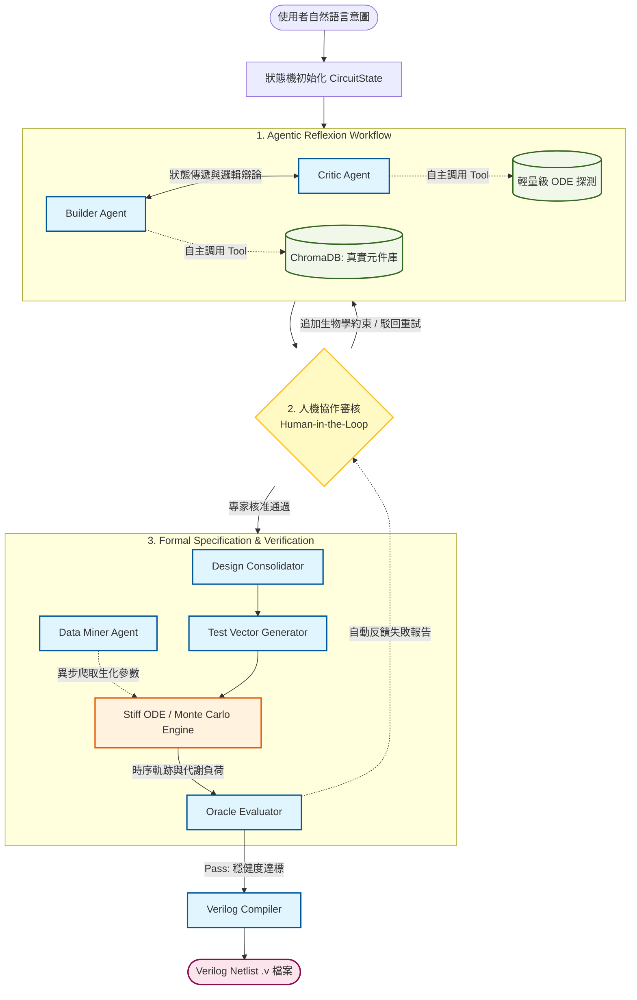

# LLM-Cello BioDrive: An Automated Genetic Circuit Design & Verification Framework
本專案旨在降低合成生物學中基因電路設計的門檻。透過引入大型語言模型（LLMs），系統能將研究人員輸入的「自然語言描述」自動轉譯為 Cello 軟體可接受的硬體描述語言（Verilog）。 

開發方法聲明 (Development Methodology)

本專案採用了 AI 輔助編程工具（Cursor Vibe Coding,Google Anigravity）進行快速迭代開發。專案的核心學術與工程價值在於「系統工作流程架構設計」與「高約束性提示詞工程 (Prompt Engineering)」，基礎程式碼與介面橋接則藉助工具加速完成，以專注於驗證概念的可行性。

## 專案簡介 (Introduction)
LLM-Cello BioDrive 是一個次世代的合成生物學生成式框架。本專案旨在橋接「自然語言需求」與「底層基因實體」，提供一個端到端（End-to-End）的自動化設計與驗證平台。

在最新版本中，系統全面升級為狀態機驅動的多智能體架構（State-Driven Multi-Agent Workflow）。有別於傳統依賴靜態邏輯閘的基因電路輔助設計軟體，本框架讓 AI 智能體（Builder, Critic, Consolidator）能自主調用工具（Autonomous Tool Calling），並結合檢索增強生成 (RAG)、常微分方程 (ODE) 統計動力學模擬，以及人機協作審核機制（Human-in-the-Loop）。系統不僅能自動編譯對應的 Verilog 網表，更能針對活體細胞不可避免的代謝負擔與基因表現雜訊，進行工業級的蒙地卡羅穩健度壓力測試。
## 核心功能 (Key Features)

### 狀態驅動的智能體架構 (State-Driven Agentic Workflow)

拋棄單純的對話歷史拼接，系統內部採用嚴謹的 CircuitState 狀態機結構，精確追蹤每一輪的拓樸草案、審查意見、模擬結果與錯誤日誌，確保多智能體協作過程中的上下文穩定性。

### 人機協作與動態約束 (Human-in-the-Loop & Dynamic Constraints)

系統不會盲目黑箱作業。在智能體完成初步對抗設計後，工作流會暫停並進入人機協核階段。研究人員可以檢視完整的辯論邏輯，並能隨時注入額外的生物學限制（例如：指定生物安全等級、避免高拷貝載體），系統將帶著完整的歷史記憶重啟迭代。

### 真實元件檢索增強 (RAG-based Component Grounding)

支援解析 Cello UCF (User Constraint File) 規格，將真實實驗室表徵過的感測器與邏輯閘寫入 ChromaDB 向量資料庫，確保 AI 設計具備物理真實性。

### 自動化生化參數探勘 (Biokinetic Data Mining)

內建 Data Miner Agent，可非同步針對 BioNumbers 等學術資料庫進行爬蟲，萃取解離常數 ($K_d$)、轉錄/轉譯率與降解率，並自動標準化為系統單位（nM 與秒）。

### 剛性方程與蒙地卡羅模擬 (Stiff ODE & Monte Carlo Analysis)

Stiff ODE Solver：採用 scipy.integrate.solve_ivp 的 Radau 演算法，精確處理生物系統中時序差異極大的剛性動力學方程。

參數擾動與群體模擬：對基礎參數疊加高斯噪音 (Gaussian perturbation)，模擬細胞群體間的外在雜訊 (Extrinsic Noise)，繪製動態時序軌跡與分佈通道。

### 自動化效能評估 (Automated Oracle Verification)

透過自動萃取真值表 (Truth Table) 計算 ON/OFF Fold Change。

設立總蛋白質代謝負荷閾值，動態攔截因資源耗盡引發的非預期細胞毒性崩潰。

### 全端本地化與隱私防護 (Local LLM & Embedding Support)

全面支援 Ollama 等本地端模型運行。從 RAG 的向量嵌入（Embeddings）到多智能體的邏輯推理，皆可在無網際網路連線的情況下於本地伺服器執行，確保敏感基因序列與專利設計的絕對隱私。

## 系統架構與工作流程 (Workflow)

需求輸入：使用者輸入自然語言描述的生物學意圖與目標底盤細胞（如 E. coli 或 B. subtilis）。

對抗式迭代：Builder 提出草案，Critic 針對啟動子強度、毒性與邏輯延遲進行批判，經三輪迭代產出最佳化規格矩陣。

動態編譯：Design Consolidator 將規格翻譯為標準 Cello Verilog 網表 (Netlist)。

壓力測試：Oracle Evaluator 自動生成 Test Vectors，調用 ODE 引擎執行 50 次蒙地卡羅抽樣，並計算穩健度通過率 (Robustness Score)。

## 快速開始 (Quick Start)

環境建置

請確保您的環境中已安裝 Python 3.10 以上版本。

1. 複製專案
git clone https://github.com/yehray1230/LLM-Cello-BioDrive-An-Automated-Genetic-Circuit-Design-Verification-Framework/tree/main
cd LLM-Cello-BioDrive-An-Automated-Genetic-Circuit-Design-Verification-Framework

2. 安裝依賴套件
pip install -r requirements.txt

3. 啟動 Streamlit 視覺化介面
python -m streamlit run app.py

系統配置

在側邊欄選擇您偏好的 LLM 供應商（支援 OpenAI, Anthropic, Google Gemini, Groq 或本地端 Ollama）。

輸入對應的 API Key。

建議先在介面中或使用 ucf_ingest.py 解析您的元件庫以建立向量索引。

## 未來展望 (Future Work)

本專案未來的發展將擺脫傳統數位邏輯的單細胞限制，轉向更具生物學原生特性的時空動態建模 (Spatio-temporal Modeling) 與巨觀結構生成 (Generative Morphogenesis)：

多細胞協同與通訊 (Multicellular Consortia & Quorum Sensing)
未來的版本將原生支援多細胞群體的設計。系統將能自動分配不同的邏輯閘到多個特化的細胞株中，並透過群體感應分子 (e.g., AHLs, Autoinducers) 建立細胞間的通訊網路，藉此降低單一細胞的代謝負擔並實現更複雜的邏輯運算。

代謝網路與基因電路的深度耦合 (Metabolic-Genetic Coupling)
除了目前的蛋白質轉錄/轉譯動力學，我們計畫整合流體平衡分析 (Flux Balance Analysis, FBA) 或全基因組代謝網路模型。這將使 AI 能夠預測基因電路在運作時，對宿主細胞核心代謝路徑（如生長速率、ATP 消耗量）的動態影響，實現更精確的資源分配預測。

反應-擴散系統與偏微分方程模擬 (Reaction-Diffusion Systems & PDE Simulation)
從現有的常微分方程 (ODE) 升級至偏微分方程 (PDE)，引入空間維度。這將能模擬訊號分子在二維培養皿或三維空間中的濃度梯度擴散，進而探索細胞群體如何透過 Turing Patterns（圖靈斑圖）形成特定的空間排列。

巨觀結構逆向工程 (Reverse-Engineering Macro-Structures)
這是本框架的最終願景：發展 3D 幾何到基因電路的逆向編譯器 (3D-to-Circuit Compiler)。使用者只需輸入目標蛋白質聚合體或生物薄膜 (Biofilm) 的 3D 巨觀結構模型，AI 代理將反向推導出所需的細胞間黏附蛋白表現時序、空間分化邏輯與細胞自溶 (Programmed Cell Death) 機制，進而由下而上 (Bottom-up) 培育出客製化的工程活體材料 (Engineered Living Materials)。

## 授權

This project is licensed under the MIT License - see the LICENSE file for details.
