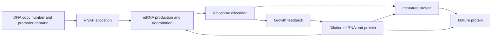

# Resource Competition Model Specification

## M5 implementation addendum (2026-07-17)

M5 is implemented as a research-preview diagnostics workflow:

- `benchmark_suite/resource_workflow.py` orchestrates context review, raw plate-reader preprocessing or governed pre-derived observations, frozen partitioning, M3 fitting, and M4 held-out validation.
- `POST /api/v1/resource-calibrations` creates and persists a workflow; list and detail endpoints expose the immutable report.
- `/web/resource-calibrations` accepts a JSON bundle and renders stage status, the dominant limiting layer, parameter-role counts, provenance, warnings, default-versus-fitted deltas, and held-out candidate comparisons.
- Raw and pre-derived input modes remain distinct. A pre-derived workflow is labelled `not_run_prederived_input` and cannot be represented as having passed raw plate-reader QC.
- Every report carries a claim boundary and `automatic_application.allowed=false`. M5 does not update production simulation parameters or the part library.

Synthetic contract tests demonstrate workflow wiring only. A real pilot dataset, externally frozen validation set, and protocol-specific review remain required before biological predictive claims.

## M6 implementation addendum (2026-07-17)

M6 adds a bounded model-analysis layer in `benchmark_suite/resource_model_analysis.py`:

- deterministic Morris one-at-a-time elementary-effects screening over explicit parameter ranges;
- a Saltelli-style Monte Carlo Sobol pilot that reports raw and clipped first/total-order indices, but is labelled `pilot_not_release_grade` because convergence intervals are not yet implemented;
- frozen-holdout comparison of a training-median baseline, a clipped linear-demand model, and `resource_competition_fit_v0.1` using the same observations and partition as the parent M5 workflow;
- an explicit recommendation that can retain the coarse model, request more discriminating data, or require validation repair, but cannot promote a model automatically;
- an SBML/BioCRNpyler readiness gate that remains `no_go` until a versioned reaction-network contract, real-pilot model-family comparison, and solver-equivalence evidence exist.

The analysis is persisted under its parent resource-calibration workflow and is available through `POST /api/v1/resource-calibrations/{workflow_id}/model-analysis` and the calibration diagnostics page. Parameter ranges are part of the report because sensitivity rankings are conditional on those ranges.

## E. coli 中心法則資源競爭模型 v0.1 計畫

**狀態**：Proposed research-preview specification
**日期**：2026-07-16
**第一個支援宿主**：*Escherichia coli* K-12
**預期用途**：計算篩選、候選排序、負荷診斷與實驗設計輔助
**非預期用途**：whole-cell model、跨宿主數位分身、臨床／製程決策或未校正的絕對體內預測

---

## 1. 決策摘要

本計畫不從零重建模擬器。現有 resource-aware ODE 已包含：

- mRNA、未成熟蛋白與成熟蛋白的動態；
- RNAP 與 ribosome 的共享資源求解；
- copy-number scaling；
- growth dilution 與 protein maturation；
- resource occupancy、burden proxy 與參數來源摘要；
- ODE、Monte Carlo 與 stochastic simulation 路徑。

v0.1 應在這個基礎上，建立一個能被小型 plate-reader 實驗校正的
*E. coli* 模型。第一版的成功標準不是重現真實細胞內所有分子，而是：

1. 正確預測額外表達負荷造成的方向性變化；
2. 在相同宿主與培養條件下，可靠排序候選電路的相對負荷；
3. 對 held-out 組合電路預測 growth 與 output fold-change；
4. 明確區分 observed、calibrated、literature prior、fixed assumption 與 inferred quantities；
5. 當資料不足時降低可信度，而不是輸出假精確的生理數值。

核心範圍決策如下：

- v0.1 只對 *E. coli* K-12 建立可驗證模型。
- Yeast 與哺乳類細胞未來應使用不同 model family，不只更換參數檔。
- 第一輪以 deterministic ODE 加 parameter ensemble 為主。
- 不把 RNA-seq、Ribo-seq 或 proteomics 設為 MVP 前置條件。
- BioCRNpyler／SBML 可作為後續互操作或交叉驗證工具，不作為 v0.1 核心依賴。

---

## 2. 與現有專案的關係

本規格細化 [future_roadmap.md](future_roadmap.md) 中以下方向：

- Host-Circuit Metabolic Burden & Growth Coupling；
- Multi-Layer Central-Dogma Resource Accounting；
- Multi-Chassis Default Profiles；
- Experimental Data Ingestion & Parameter Fitting；
- Global Parameter Sensitivity。

現有 [model_assumptions.md](model_assumptions.md) 仍是目前已實作模型的說明；本文件描述下一個需要實驗校正的研究版本。兩者的 claim boundary 必須保持一致：在通過本文件的驗證門檻前，模型仍只能稱為 computational screening path。

### 2.1 可保留的現有元件

- `WarmStartResourceSolver` 的準穩態資源守恆求解；
- `ResourceAwareSimulation` 的 mRNA／protein dynamics；
- operon、polarity、maturation、retroactivity 與 temporal input 支援；
- `BatchODESimulator` 的 reproducibility、cache、trace 與 Monte Carlo 合約；
- `HostProfile` 與 parameter provenance 結構；
- parameter-fit snapshot 與 default-versus-fitted 比較流程；
- sensitivity-analysis 與報告輸出基礎。

### 2.2 需要補強的部分

- 宿主內源性資源需求目前是隱含背景，需加入可解釋的 baseline capacity；
- growth feedback 需由同一實驗條件下的資料校正；
- translation demand 需納入 CDS length／elongation time；
- copy number 應區分 declared、literature prior 與 measured；
- 不應同時自由擬合所有 total resource、binding constant 與 production rate；
- 現有 host calibration 摘要需擴展為真正的 fitting、validation 與 uncertainty contract；
- yeast profile 不應被解讀成與 *E. coli* 同等可信的生理模型。

---

## 3. 科學問題與模型輸出

### 3.1 v0.1 要回答的問題

對於在相同 strain、medium、temperature 與 measurement protocol 下的候選：

- 哪個電路造成較高的 transcriptional demand？
- 哪個電路造成較高的 translational demand？
- 增加 promoter、RBS 或 copy-number 強度後，output 與 growth 如何改變？
- 一個模組加入另一個模組後，原模組的 output 會下降多少？
- 預測主要受哪個 observed input、calibrated parameter 或 default assumption 支配？
- 哪些候選的相對排序對參數不確定性仍然穩健？

### 3.2 v0.1 不回答的問題

- 細胞內真正的 free RNAP 或 free ribosome 絕對數量；
- 未做條件校正時的跨培養基、跨溫度或跨 strain 絕對預測；
- 全宿主代謝流量、ATP／amino-acid pool 或 proteome allocation 的完整狀態；
- 壓力反應、毒性、蛋白聚集與膜負荷的完整機制；
- Yeast／HEK293 與 *E. coli* 共用同一方程式後的直接比較；
- 濕實驗成功保證。

### 3.3 主要輸出

每個模擬結果至少輸出：

- `relative_growth_rate`：相對於 matched empty-vector control；
- `output_fold_change`：相對於相同模組的 reference condition；
- `transcriptional_demand_index`；
- `translational_demand_index`；
- `capacity_loss_fraction`；
- `resource_limited_layer`：DNA／transcription／translation／growth feedback／unknown；
- `dominant_parameters` 與 sensitivity summary；
- prediction interval；
- observed/defaulted/inferred parameter counts；
- calibration context 與 model version；
- claim-safe warnings。

---

## 4. v0.1 系統邊界

### 4.1 固定的實驗脈絡

一份 calibration profile 必須綁定：

- host organism；
- strain；
- medium 與主要 supplement；
- temperature；
- aeration／shaking 條件；
- culture format 與 working volume；
- plate-reader instrument 與 gain settings；
- plasmid backbone／origin；
- selectable marker 與 antibiotic concentration；
- growth phase used for fitting；
- reporter identity 與 maturation model；
- protocol version。

不同 context 的 profile 不可靜默混用。若使用者跨 context 套用模型，結果必須標記為 extrapolation。

### 4.2 顯式表示的層級



### 4.3 暫時聚合的生物學

下列機制在 v0.1 中只作為 aggregate coefficient、prior 或 warning：

- nucleotide／amino-acid availability；
- energy and redox burden；
- chaperone capacity；
- protease saturation；
- membrane insertion burden；
- stress response；
- ribosome heterogeneity；
- sigma-factor competition；
- cell-cycle-dependent copy number。

若某一候選明顯依賴上述機制，模型應回報 `out_of_model_scope`，而不是以一般 resource competition 解釋全部現象。

---

## 5. 數學模型

### 5.1 狀態變數

每個 operon `o` 使用一個 mRNA 狀態，每個 gene `i` 使用未成熟與成熟蛋白狀態：

```text
y = [m_o, p_immature_i, p_mature_i]
```

可選的 biomass／OD 狀態只用於模擬觀測值；若不需要預測完整 OD trajectory，growth rate 可保持為 algebraic feedback。

### 5.2 mRNA 動態

\[
\frac{dm_o}{dt}
= \alpha_o\,CN_o\,u_o(t)\,\phi_{TX}
- (\delta_{m,o}+\mu)m_o
\]

其中：

- `alpha_o`：operon 的有效轉錄能力；
- `CN_o`：plasmid copy number 或等效 DNA dosage；
- `u_o(t)`：regulatory／temporal input；
- `phi_TX`：可用 RNAP 所造成的資源縮放；
- `delta_m,o`：mRNA degradation；
- `mu`：growth dilution。

### 5.3 蛋白動態

\[
\frac{dp_{u,i}}{dt}
= \beta_i m_{o(i)}\phi_{TL}
-(k_{mat,i}+\delta_{p,i}+\mu)p_{u,i}
\]

\[
\frac{dp_{m,i}}{dt}
= k_{mat,i}p_{u,i}
-(\delta_{p,i}+\mu)p_{m,i}
\]

`beta_i` 必須反映 RBS strength；translation demand 則需額外反映 CDS length 或 ribosome residence time，避免把短 reporter 與長酵素視為相同負荷。

### 5.4 準穩態資源分配

保留現有 mass-balance 解法，但把 host background demand 顯式納入：

\[
P_{tot}=P_f+B_{P,host}
+\sum_o D_{P,o}\frac{P_f}{K_P+P_f}
\]

\[
R_{tot}=R_f+B_{R,host}
+\sum_i D_{R,i}\frac{R_f}{K_R+R_f}
\]

其中 `P` 表示 RNAP、`R` 表示 ribosome。`B_host` 不需要宣稱為直接量測的分子數，可以由 empty-vector control 所定義的 baseline available capacity 表示。

資源縮放可寫為：

\[
\phi_{TX}=\frac{P_f}{K_P+P_f},\qquad
\phi_{TL}=\frac{R_f}{K_R+R_f}
\]

若資料不足以辨識 total resource 與 binding constants，公開輸出應改用相對 demand index，不輸出絕對 free-resource concentration。

### 5.5 Translation demand

第一版建議：

\[
D_{R,i}\propto m_{o(i)}\,s_{RBS,i}\,\tau_{elong,i}
\]

\[
\tau_{elong,i}\approx
\frac{L_{AA,i}}{v_{elong}}
\]

其中 `L_AA` 為蛋白長度，`v_elong` 為 translation elongation prior。未提供 CDS 時使用預設長度，但必須降低 confidence。

### 5.6 Growth feedback

v0.1 不固定假設 growth 與 free ribosome 完全線性。推薦形式為：

\[
\mu=\mu_0\,g(\phi_{TL};\theta_g)
\]

`g` 可選：

- 線性 normalized baseline；
- Hill-type monotonic function；
- monotonic spline。

函數與參數必須由 matched OD time-series 校正。預設使用最簡單、可辨識且通過 held-out validation 的形式；較複雜模型只有在資訊準則與 held-out error 都改善時才升級。

### 5.7 Observable model

模型狀態不能直接等同 plate-reader fluorescence。應加入觀測模型：

\[
F(t)=a_F\,p_m(t)\,N_{cells}(t)+b_F
\]

實務上可使用 blank-corrected fluorescence／OD，或在 exponential phase 中使用 fluorescence production rate per OD。所有 normalization 方式需寫入 protocol version。

---

## 6. 參數分級與可辨識性策略

### 6.1 參數來源類型

| 類型 | 例子 | 規則 |
|---|---|---|
| Observed | OD、fluorescence、inducer、CDS length | 保留原始值、單位與量測脈絡 |
| Calibrated | module demand、growth coupling、fluorescence scale | 儲存 fit、interval、dataset 與方法 |
| Literature prior | elongation rate、RNAP/ribosome 範圍 | 只能限制範圍，不視為本地真值 |
| Fixed assumption | maturation structure、resource equation | 必須 versioned 並可在報告中列出 |
| Inferred | free-resource fraction、capacity loss | 標明不是直接量測 |

### 6.2 v0.1 可以擬合的參數

- 每個 calibration module 的 transcriptional demand coefficient；
- 每個 calibration module 的 translational demand coefficient；
- circuit output 對 external load 的 sensitivity；
- normalized growth-coupling parameters；
- reporter scale／background；
- 有充分 time-course 時的 effective production rate。

### 6.3 預設固定或強 prior 的參數

- RNAP total 與 ribosome total；
- `Km_RNAP` 與 `Km_ribosome`；
- elongation speeds；
- mRNA degradation，除非有 RNA time-course；
- reporter maturation，除非有獨立校正；
- protein degradation，除非使用 degradation tag 並有獨立量測。

不得在只有 OD＋單色 fluorescence 的資料下，同時自由擬合上述所有參數。若多組參數能同樣解釋資料，報告應說明 non-identifiability，並只保留可預測的合併參數。

### 6.4 擬合方法

第一版建議：

1. blank correction 與 well-level QC；
2. 自動辨識 exponential-growth window，但允許人工覆核；
3. 使用 log-space positive parameters；
4. 多個 inducer conditions 聯合擬合；
5. biological replicate 使用 hierarchical 或 replicate-aware residual；
6. 先做 bounded least squares；
7. 使用 bootstrap 或 profile likelihood 估計 interval；
8. 保留 held-out construct／backbone 作真正驗證；
9. 儲存 optimizer、initialization、seed 與失敗原因。

若後續需要 Bayesian inference，應作為可選研究路徑，而不是 v0.1 的必要依賴。

---

## 7. 資料取得計畫

### 7.1 Tier 0：公開資料與 literature priors

用途：設定合理量級、參數範圍與模型形式。

優先資料：

- BioNumbers 的 RNAP、ribosome、elongation 與 growth-dependent ranges；
- 已發表的 resource competition／capacity monitor 資料；
- reporter maturation 與 degradation 文獻；
- plasmid origin 的 copy-number 範圍；
- 特定 strain／medium 的 growth-rate 參考。

公開資料不得直接覆蓋本地 calibration。每筆資料至少保存：source、organism、strain、medium、temperature、unit、reported uncertainty 與使用方式。

### 7.2 Tier 1：MVP plate-reader calibration

這是 v0.1 的必要資料層。

#### 最小構築組

- empty-vector control；
- constitutive capacity reporter；
- capacity reporter 加可誘導 competitor；
- circuit output reporter；
- 至少一組不同 RBS 或不同 copy-number backbone 作 held-out validation。

capacity reporter 與 competitor／circuit output 應使用可分離的 fluorescence channels。

#### 最小條件矩陣

- 6–8 個 inducer levels，包含 zero 與 saturation 附近；
- 至少 3 biological replicates；
- 每個 biological replicate 至少 2 technical wells；
- 每 5–10 分鐘量測 OD600 與兩個 fluorescence channels；
- 涵蓋 lag、exponential 與 early stationary phase；
- 同板包含 media blank 與 matched empty-vector control。

#### 主要衍生量

- exponential growth rate；
- lag time；
- maximum OD；
- fluorescence／OD trajectory；
- fluorescence production rate per OD；
- capacity loss relative to empty vector；
- circuit output fold-change；
- replicate variability 與 excluded-well reasons。

### 7.3 Tier 2：可選的 targeted measurements

依 sensitivity 與 identifiability 結果決定，不預先全部執行：

- ddPCR/qPCR：plasmid copy number；
- RT-qPCR：mRNA abundance／decay；
- flow cytometry：single-cell distribution、bimodality 與 population heterogeneity；
- targeted proteomics：selected protein abundance；
- microscopy：cell morphology 或 reporter localization。

### 7.4 Tier 3：合作型研究資料

- RNA-seq；
- Ribo-seq；
- global proteomics；
- metabolomics；
- direct resource-pool measurements。

Tier 3 用於擴張或挑戰模型，不是 v0.1 release gate。

---

## 8. Plate-reader 資料合約

### 8.1 原始資料必要欄位

```text
experiment_id
protocol_version
plate_id
well
timestamp_s
biological_replicate
technical_replicate
strain
medium
temperature_c
shaking_condition
construct_id
backbone_id
origin
inducer_name
inducer_concentration
inducer_unit
od600
capacity_fluorescence
output_fluorescence
instrument
gain_settings
```

### 8.2 Construct metadata

```text
construct_id
promoter_id
rbs_id
cds_id
cds_length_bp
protein_length_aa
terminator_id
declared_copy_number
copy_number_source
reporter_maturation_prior
sequence_available
```

### 8.3 QC 規則

- negative OD／fluorescence 在 blank correction 前後分別處理；
- 不靜默刪除 outlier wells；
- 記錄 bubble、edge effect、saturation 與 missing time point；
- technical replicate 不得被當成 biological replicate；
- exponential window 的演算法、門檻與人工覆核必須保存；
- 不同 instrument gain 的值不可直接合併，除非有 calibration curve；
- 每個 derived metric 可追溯至原始 well 與 preprocessing version。

---

## 9. 實驗設計與識別順序

### Experiment A：Empty-vector baseline

**目的**：建立 `mu0`、OD baseline、autofluorescence 與 plate effect。

**輸出**：matched baseline profile 與 measurement noise。

### Experiment B：Capacity sensor response

**目的**：確認 capacity reporter 能感測外加表達負荷。

**設計**：同一 competitor、同一 backbone、6–8 inducer levels。

**輸出**：capacity-loss curve、growth-loss curve 與初始 growth-coupling fit。

### Experiment C：Transcription-versus-translation perturbations

**目的**：避免所有負荷只被一個 aggregate coefficient 吸收。

**設計**：

- promoter-strength ladder，RBS 與 CDS 固定；
- RBS-strength ladder，promoter 與 CDS 固定；
- 可行時加入不同 CDS length，但維持相近 protein function／reporter readout。

**輸出**：TX demand 與 TL demand 的可分辨程度。

### Experiment D：Copy-number perturbation

**目的**：驗證 DNA dosage 對 transcriptional demand 與 growth 的影響。

**設計**：至少兩種 origin；其中一種保留作 held-out validation。

**輸出**：copy-number scaling 與 model extrapolation warning。

### Experiment E：Compositional validation

**目的**：測試單一模組校正是否能預測多模組組合。

**設計**：先校正 module A、B，再預測 A+B；不得使用 A+B 重新擬合後聲稱驗證成功。

**輸出**：held-out growth、capacity 與 output prediction。

---

## 10. 驗證與 release gates

### 10.1 Software gates

- 所有方程式與參數 schema 有 unit tests；
- empty-vector 時 resource capacity 正規化為 baseline；
- 增加 demand 不會非物理性地增加 free resource；
- zero-expression limit 回到 baseline growth；
- mass-balance solver 在參數範圍內收斂；
- 同 seed、model version 與 input 可重現；
- fitted profile 不會靜默覆蓋 built-in default；
- provenance、context mismatch 與 extrapolation warning 有 API／UI tests。

### 10.2 Scientific validation gates

初始建議門檻，需在 pilot 後依 measurement noise 再確認：

- burden ranking 的 Spearman correlation `>= 0.70`；
- held-out relative growth 的 median absolute percentage error `<= 20%`；
- held-out output fold-change 的方向正確率 `>= 80%`；
- prediction interval coverage 不得系統性過窄；
- 至少一個 held-out backbone／RBS 或 module composition；
- 複雜模型相較簡單 baseline 必須改善 held-out error；
- sensitivity 結果不得由未標示的 default parameter 單獨主導。

這些門檻不是生物學普遍定律，而是 v0.1 的工程 go/no-go gate。若 pilot noise 顯示門檻不合理，需版本化修改並記錄理由。

### 10.3 Claim gates

| 驗證狀態 | 允許說法 |
|---|---|
| 無本地資料 | heuristic／default-parameter computational screening |
| 已 fit、未 held-out | fitted to this dataset；不得稱 validated |
| 通過同 context held-out | calibrated comparative predictor for the stated context |
| 跨 context 未驗證 | exploratory extrapolation |
| 跨宿主 | unsupported，除非使用獨立 model family 與驗證資料 |

---

## 11. 計算與效能策略

### 11.1 預設求解

- deterministic ODE 為一般 plate-reader comparison 的主路徑；
- 保留目前準穩態 RNAP／ribosome solver；
- non-stiff case 使用現有高品質 ODE path；
- stiffness 或多時間尺度時使用適合 stiff system 的 solver；
- 對狀態與參數進行尺度化，避免 nM、秒與大 copy-number 造成數值問題。

### 11.2 Fitting cost

單次小型電路 ODE 不應是瓶頸；成本主要來自多條件、多 replicate 與 uncertainty runs。應：

- cache 不依賴 fit parameter 的 preprocessing；
- cache 相同 model/input 的 simulation；
- 先用低成本 point estimate，再對選定模型做 bootstrap；
- 將條件或 bootstrap runs 平行化；
- 設定 convergence、timeout 與 failed-fit contract；
- 不因 optimizer failure 回退到看似成功的 default fit。

### 11.3 Sensitivity

順序建議：

1. local finite-difference sensitivity 作除錯；
2. Morris screening 找出重要參數；
3. 只對少數重要參數執行 Sobol；
4. 使用 profile likelihood／bootstrap 檢查 identifiability；
5. 報告候選排名是否跨 uncertainty ensemble 穩定。

### 11.4 Stochastic simulation

只有在以下情況才使用 SSA：

- low copy number；
- low molecule count；
- noise-driven switching；
- bistability／rare transitions；
- bulk ODE 無法解釋 flow-cytometry distribution。

SSA 不作為 bulk plate-reader fitting 的預設路徑。

---

## 12. 軟體架構草案

### 12.1 建議新增的概念

```text
ResourceCompetitionModelSpec
CalibrationContext
ResourceCalibrationDataset
ResourceCalibrationRun
ResourceCalibrationProfile
ParameterEstimate
ValidationSplit
ValidationReport
ResourceCompetitionResult
```

### 12.2 建議責任邊界

- ingestion：只負責讀取、正規化與驗證原始資料；
- preprocessing：blank correction、QC、growth-window 與 derived metrics；
- model：方程式與 observable transformation；
- fitting：objective、bounds、optimizer 與 uncertainty；
- validation：held-out evaluation，不得重新擬合；
- registry：保存 immutable versioned calibration profiles；
- simulation：將 profile 套用到候選；
- reporting：輸出 provenance、interval、warnings 與 claim boundary。

### 12.3 與現有檔案的預期接點

- `src/tools/ode_simulator.py`：方程式、resource solver、trace；
- `src/schemas/host_profile.py`：宿主與 biophysical defaults；
- `src/agents/data_miner_agent.py`：literature/default parameter provenance；
- `application/services.py`：fit、compare、validation orchestration；
- `src/tools/sensitivity_analysis.py`：Morris／Sobol 前的既有分析入口；
- `src/api/` 與 `src/web/`：upload、fit status、comparison 與 warnings；
- `tests/`：mass balance、identifiability、validation split 與 API contract。

不應讓 `DataMinerAgent` 擷取到的單筆文獻數值自動成為 validated calibration。文獻參數只能成為 prior 或 explicit override。

---

## 13. 分階段交付計畫

### M0：規格與資料合約

**實作狀態（2026-07-16）**：Completed foundation。

- `src/schemas/resource_calibration.py` 已建立 versioned calibration context、
  construct metadata、plate-reader long-format record、parameter taxonomy、
  frozen validation split 與 cross-record dataset validation。
- `tests/fixtures/resource_calibration/` 已提供可追溯至原始 CSV row／well／
  timestamp 的 synthetic dataset。
- `tests/test_resource_calibration_m0.py` 已覆蓋 round-trip、context mismatch、
  taxonomy-to-governance mapping、held-out split isolation 與 JSON serialization。

此狀態只表示 schema foundation 完成。正式 CSV ingestion、plate map、QC 與
derived metrics 仍屬 M2，不應由 M0 狀態推論為已完成。

**交付**：

- 確認本文件；
- calibration context schema；
- raw plate-reader schema；
- construct metadata schema；
- parameter taxonomy；
- validation split contract。

**完成條件**：一份 synthetic dataset 可通過 schema validation，且每個 derived metric 能追溯來源。

### M1：Baseline-relative model

**實作狀態（2026-07-16）**：已完成 research-preview 基礎切片。`baseline_relative_v0.1` 目前為 opt-in deterministic／noisy ODE 模式，legacy preview 仍維持預設；stochastic 路徑在校準 propensity 實作前會明確拒絕此模式。

**交付**：

- empty-vector baseline capacity；
- explicit host-background demand 或 normalized equivalent；
- relative growth／capacity outputs；
- CDS-length-aware translation demand；
- unit 與 limiting-case tests。

**已落地**：

- 以 baseline-free fractions 推導 host-background demand，零合成負載時相對生長率為 `1.0`、合成容量損失為 `0.0`；
- 轉譯需求納入 CDS／protein length、RBS strength 與 elongation rate；缺少長度時使用帶警告的 `250 aa` 固定假設；
- `resource_model_comparison` 並列 legacy occupancy 與 baseline-relative summary，保留比較與回退路徑；
- simulation provenance 與 configuration hash 納入 resource model mode、長度 metadata 與 construct metadata；
- limiting-case、單調性、metadata precedence、legacy-default 與 stochastic-boundary 測試已加入 `tests/test_resource_competition_m1.py`。

**聲明邊界**：預設 RNAP／ribosome baseline-free fractions 仍是可覆寫的固定假設，不是宿主實測校準值；本階段輸出只用於相對篩選，不宣稱絕對生長率或 proteome allocation 預測。

**完成條件**：所有 monotonicity、zero-load、mass-balance 與 reproducibility tests 通過。

### M2：Plate-reader ingestion 與 QC

**實作狀態（2026-07-16）**：已完成可重現的 research-preview preprocessing slice。實作位於 `benchmark_suite/resource_plate_reader.py`，輸入為長格式 raw CSV、M0 calibration context／construct metadata，以及獨立 plate map。

**交付**：

- CSV ingestion；
- plate map；
- blank correction；
- replicate-aware QC；
- exponential-window extraction；
- derived metric report。

**已落地**：

- raw CSV schema validation、duplicate measurement 與 unknown-well 防護；
- plate map validation，明確區分 blank control 與 sample metadata；
- 依 experiment／plate／timepoint 的 blank-well median 進行 OD600、capacity 與 output channel correction；
- 以 blank-corrected OD600 範圍選取 exponential window，使用 log-linear growth fit 與 R-squared gate；
- 依 construct＋inducer condition 執行 biological-replicate outlier 與 CV QC；
- 每個 excluded well 回傳 stable reason code 與 detail；全部 samples 未通過時回傳 `failed_qc`；
- derived metrics 包含 growth rate、capacity/output per OD 與同 plate empty-vector-relative capacity loss；
- 每個 metric 保存 source trace IDs、preprocessing version、plate-map fingerprint、window 與 baseline provenance；
- 固定 synthetic fixture、dataset composition、重現性、replicate failure、missing blank 與 unknown well 測試已加入 `tests/test_resource_plate_reader_m2.py`。

**聲明邊界**：目前 QC threshold 是可設定 heuristic，尚未由真實 plate-reader dataset 驗證；M2 不會擬合 ODE 參數，也不會將 derived metrics 自動寫回 simulation calibration profile。

**完成條件**：同一 fixture 的 preprocessing 可重現，excluded wells 有明確理由。

### M3：Parameter fitting

**實作狀態（2026-07-16）**：已完成 bounded joint-fitting research-preview slice。實作位於 `benchmark_suite/resource_parameter_fitting.py`，直接消費 M2 growth／capacity-loss metrics 或同契約 synthetic observations。

**交付**：

- bounded joint fit；
- log-space parameters；
- fit diagnostics；
- bootstrap／profile interval；
- immutable calibration profile；
- default-versus-fitted comparison。

**已落地**：

- 僅擬合 `aggregate_demand_coefficient` 與 `normalized_growth_coupling` 兩個可觀測合併參數；TX／TL demand 拆分與其他 cell-resource constants 保持 fixed／prior；
- 使用 positive log-space、explicit bounds 與 SciPy trust-region least squares 聯合擬合 capacity loss 與 relative growth；
- residual 依 observation sigma 加權，M2 observations 依 construct、inducer condition、well 與 biological replicate 保留；
- diagnostics 包含 optimizer state、RMSE、distinct demand levels、dynamic range、Jacobian rank／condition number、bound hits 與 reason codes；
- 使用固定 seed 的 replicate-stratified bootstrap 產生 95% interval，並記錄 attempts／successes；
- frozen calibration profile 保存 schema/model version、input fingerprint、source observation IDs、fixed assumptions 與 claim state；
- default-versus-fitted comparison 回傳 ratio 與 percent change，但不自動寫回 ODE；
- identifiability gate 未通過時標示 `non_identifiable`、移除 interval 並設定 `usable_for_prediction=false`；
- synthetic recovery、input-order reproducibility、immutability、single-level non-identifiability 與 M2 two-level no-go tests 已加入 `tests/test_resource_parameter_fitting_m3.py`。

**聲明邊界**：`identifiable` 只表示在 `resource_competition_fit_v0.1` 與目前 observation design 下可估；profile 仍是 `fitted_to_synthetic_or_local_dataset_not_heldout_validated`，不得在 M4 前宣稱 held-out predictive validity。

**完成條件**：synthetic recovery tests 通過；non-identifiable dataset 能被辨識，而不是輸出過度確定結果。

### M4：Held-out validation

**實作狀態（2026-07-16）**：已完成 frozen held-out validation research-preview slice。實作位於 `benchmark_suite/resource_validation.py`；capacity／growth prediction 只讀取 immutable M3 profile，不在 validation path 重新擬合。

**交付**：

- train／validation split；
- validation-only execution path；
- ranking、growth、fold-change 與 interval metrics；
- claim-state assignment。

**已落地**：

- 使用 frozen M0 `ValidationSplit` 驗證 training／validation construct membership；
- 核對 M3 source observation IDs 與 input fingerprint，拒絕 observation leakage、training drift 與 context mismatch；
- held-out capacity／growth prediction 直接使用 M3 combined parameters；
- burden ranking 使用 Spearman correlation，growth error 使用 median absolute percentage error；
- parameter bootstrap bounds 加上 observation sigma，產生 capacity／growth predictive coverage；
- 比較 fitted model 與 training-median simple baseline 的 held-out growth error；
- output fold-change direction 需要顯式 observed／predicted mappings 與 `output_prediction_model_id`，缺少時為 `not_evaluable` 並 no-go；
- `resource_heldout_gates_v0.1` 固定 Spearman `>= 0.70`、growth MAPE `<= 20%`、output direction `>= 80%`、combined interval coverage `>= 80%`；
- 全 gates 通過時 claim state 為 `calibrated_comparative_predictor_for_stated_context`；否則維持 fitted-only／non-identifiable no-go；
- synthetic go、reproducibility、missing-output no-go、failed-metric no-go、fingerprint／context／leakage blocking，以及 non-identifiable profile tests 已加入 `tests/test_resource_validation_m4.py`。

**聲明邊界**：目前 go case 為 synthetic validation harness proof，不代表真實 pilot dataset 已通過。實際 public claim 必須綁定同一 host、strain、medium、instrument、gain、protocol 與 frozen held-out dataset。

**完成條件**：pilot dataset 通過預先確認的 release gates，或產生可解釋的 no-go report。

### M5：API／UI 診斷工作流

**交付**：

- upload 與 context review；
- QC／fit／validation status；
- dominant-layer explanation；
- observed/defaulted/inferred summary；
- uncertainty 與 extrapolation warnings；
- candidate comparison view。

**完成條件**：使用者可以從原始資料追溯至 calibration profile 與候選結果。

### M6：進階敏感度與互操作

**交付**：

- Morris screening；
- 選擇性 Sobol；
- SBML／BioCRNpyler 交叉驗證研究；
- richer resource model 的 model-comparison harness。

**完成條件**：新增複雜度在 held-out data 上提供可量化改善。

### M7：第二 model family 的 go/no-go

**候選**：*S. cerevisiae*。

在開始前必須先決定：

- nucleus／cytoplasm compartment；
- RNAP classes；
- mRNA export；
- eukaryotic translation assumptions；
- yeast-specific calibration constructs；
- 獨立 release gates。

不得只更換 *E. coli* profile constants 就標記為完成。

---

## 14. 風險與緩解策略

| 風險 | 徵兆 | 緩解 |
|---|---|---|
| 參數不可辨識 | 多組參數得到相同 fit | 固定 priors、改用合併 demand coefficient、增加 targeted measurement |
| Plate effect／instrument drift | replicate 與 plate 系統偏移 | 同板 controls、protocol version、plate randomization、calibration standards |
| Fluorescence 不代表 production | stationary phase 累積或 maturation delay | fit production rate、加入 observable model、限制 fitting window |
| Copy number 不穩定 | 不同 growth condition 預測失真 | ddPCR subset、context-specific prior、extrapolation warning |
| Growth feedback 過度簡化 | 高負荷時殘差系統偏移 | 比較 linear/Hill/spline，但以 held-out improvement 決定 |
| 把 toxicity 當 resource burden | growth 下降但 capacity pattern 不符 | out-of-scope classifier、毒性 controls、不要強迫單一機制解釋 |
| 跨宿主誤用 | yeast/HEK 套用同一方程式 | model-family gate、API 阻擋或強 warning |
| CRN 模型膨脹 | fitting 過慢、參數更多但無改善 | 保留 coarse-grained core，進階 CRN 只作研究比較 |
| 假精確輸出 | narrow interval 但依賴 defaults | uncertainty audit、provenance summary、minimum evidence gate |

---

## 15. 第一個實作切片

第一個 coding slice 應保持小而可驗證，只做：

1. `CalibrationContext` 與 plate-reader long-format schema；
2. empty-vector-normalized capacity 定義；
3. CDS-length-aware translational demand；
4. host-background demand 的 normalized representation；
5. synthetic calibration fixture；
6. zero-load、monotonicity、mass-balance 與 context-mismatch tests；
7. 新舊模型並列輸出，不直接取代現有 preview model。

此切片不包含：

- 真實 fitting optimizer；
- UI；
- Sobol；
- BioCRNpyler 整合；
- yeast；
- 新的 public biological validation claim。

完成後再用 synthetic recovery 與一份小型實驗 fixture 判斷是否進入 M2/M3。

---

## 16. Go／No-Go 決策點

### Go：進入真實資料 fitting

- synthetic recovery 可辨識預定的合併參數；
- baseline-relative model 通過 limiting-case tests；
- plate-reader protocol 與 construct metadata 完整；
- capacity sensor 對 inducer/load 呈現可重現反應。

### No-Go：停在 heuristic screening

- capacity reporter 的變化小於 measurement noise；
- biological replicates 無法重現；
- TX 與 TL demand 在現有實驗中完全不可分辨；
- growth loss 主要來自模型未涵蓋的 toxicity／stress；
- held-out 組合預測不優於簡單 empirical baseline。

No-Go 不是專案失敗；它表示模型應維持 diagnostic heuristic，並先改善資料或縮小 claim。

---

## 17. 參考研究方向

本計畫的實驗與模型設計可優先對照：

1. Ceroni et al., *Quantifying cellular capacity identifies gene expression designs with reduced burden*, Nature Methods, 2015. DOI: `10.1038/nmeth.3339`.
2. Qian et al., *Resource Competition Shapes the Response of Genetic Circuits*, ACS Synthetic Biology, 2017. DOI: `10.1021/acssynbio.6b00361`.
3. Sechkar et al., *A coarse-grained bacterial cell model for resource-aware analysis and design of synthetic gene circuits*, Nature Communications, 2024. DOI: `10.1038/s41467-024-46410-9`.
4. BioNumbers entries for growth-dependent RNAP, ribosome and elongation ranges; values must retain their original measurement context.

文獻提供模型形式與 prior，不等於本專案已完成濕實驗校正。

---

## 18. 最終完成定義

v0.1 只有在下列條件全部成立時，才能稱為「calibrated comparative resource-competition model」：

- 有 versioned *E. coli* calibration context；
- 有可追溯的 raw plate-reader dataset；
- fitting 與 validation 使用分離資料；
- 通過預先定義的 held-out gates；
- output 包含 uncertainty 與 parameter provenance；
- context mismatch 會被阻擋或清楚標示；
- 文件、API、UI 與 public claims 同步；
- 未暗示 whole-cell、跨宿主或濕實驗成功保證。

在此之前，正確名稱仍是：

> **Resource-aware computational screening model / 資源感知計算篩選模型**
